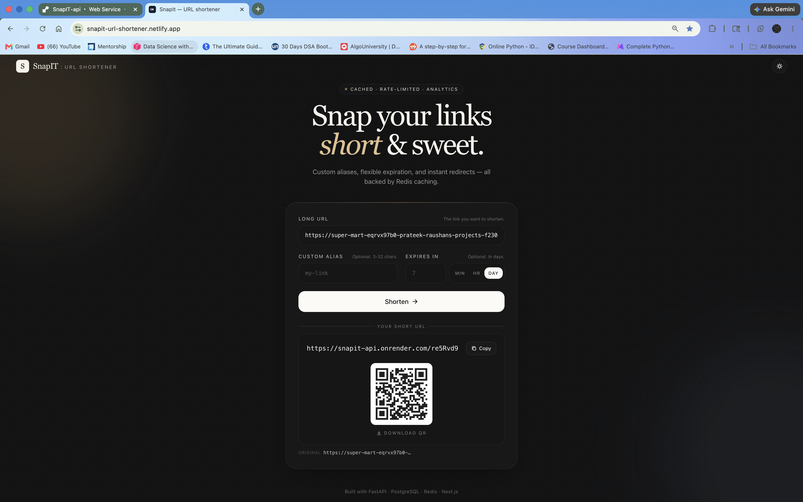
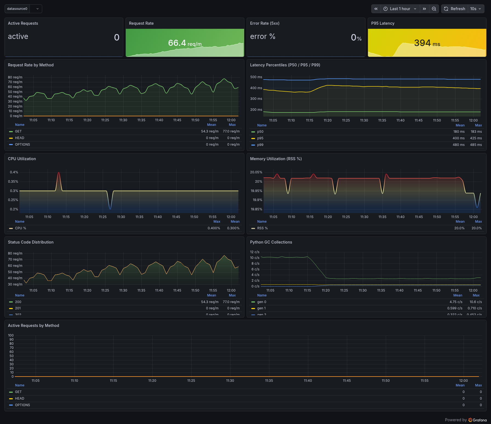

***

<div align="center">
  <h1>SnapIT : URL Shortener</h1>
  <p><b>A production-ready, low-latency URL shortener with analytics and caching.</b></p>


  
  <a href="https://snapit-url-shortener.netlify.app" target="_blank">
    
  </a>
  
  
  
  
</div>

<br>

**SnapIT** is a highly scalable, full-stack URL shortener built with FastAPI, PostgreSQL, Redis, Next.js, and Tailwind CSS. It features Redis cache-aside low-latency redirects, race-safe custom aliases, per-IP rate limiting, non-blocking click analytics, and graceful HTTP 410 expiration handling. 

---

## Architecture & Redirect Flow

```text
                  ┌─────────┐      Miss       ┌────────────┐
 ┌────────┐  GET  │         ├────────────────►│            │
 │ Client ├──────►│  Redis  │                 │ PostgreSQL │
 └────────┘       │  Cache  │◄────────────────┤     DB     │
                  └────┬────┘   Repopulate    └──────┬─────┘
                       │                             │
                   Hit │ (302 Redirect)              │ Async Update
                       ▼                             ▼
                 ┌───────────┐                 ┌─────────────┐
                 │ Redirect  │                 │ Background  │
                 │ completed │                 │ Analytics   │
                 └───────────┘                 └─────────────┘
```

---

## Table of Contents
1. [Key Features](#1-key-features)
2. [API Reference](#2-api-reference)
3. [Database Schema](#3-database-schema)
4. [Quick Start (Local Development)](#4-quick-start-local-development)
5. [Running Tests](#5-running-tests)
6. [Project Structure](#6-project-structure)
7. [Environment Configuration](#7-environment-configuration)
8. [Free-Tier Deployment Guide](#8-free-tier-deployment-guide)
9. [Production Notes](#9-production-notes)

---

## 1. Key Features
* **Low-Latency Redirects:** Utilizes Redis cache-aside architecture. The database is exclusively touched on a cache miss.
* **Race-Safe Aliases:** Custom aliases are enforced for uniqueness at the database layer to prevent race conditions.
* **Rate Limiting:** Fixed-window per-IP rate limiting backed by Redis, returning `429 Too Many Requests` with `Retry-After` headers.
* **Async Analytics:** Click-counts and `last_accessed` timestamps are recorded via fire-and-forget background tasks so redirects never block.
* **Graceful Expiration:** Supports TTL on URLs, returning an `HTTP 410 Gone` status for expired links.
* **Containerized:** Fully packaged with Docker Compose for a one-command local development environment.

---

## 2. API Reference

| Method | Path | Description |
| :--- | :--- | :--- |
| `POST` | `/api/shorten` | Create a short URL |
| `GET`  | `/api/analytics/{id}` | Retrieve click-count and timestamps |
| `GET`  | `/{short_id}` | 302 Redirect (404 missing, 410 expired) |
| `GET`  | `/health/live` | Liveness probe |
| `GET`  | `/health/ready` | Readiness probe (DB + Redis check) |
| `GET`  | `/docs` | OpenAPI Swagger UI |

<details>
<summary><b>Click to view POST <code>/api/shorten</code> Payload & Response</b></summary>

**Request Payload:**
```json
{
  "original_url": "https://example.com/very/long/path",
  "custom_alias": "my-link",
  "expires_in_days": 30
}
```

**Response (201 Created):**
```json
{
  "short_id": "my-link",
  "short_url": "http://localhost:8000/my-link",
  "original_url": "https://example.com/very/long/path",
  "custom_alias": "my-link",
  "created_at": "2026-04-23T10:15:00Z",
  "expires_at": "2026-05-23T10:15:00Z"
}
```
*Note: Errors handle `400` invalid URL/alias, `409` alias taken, and `429` rate-limited.*
</details>

---

## 3. Database Schema
Table: `urls`

| Column | Type | Notes |
| :--- | :--- | :--- |
| `id` | `bigint` | PK, autoincrement |
| `original_url` | `varchar(2048)` | Not null |
| `short_id` | `varchar(64)` | Unique, indexed (hot-path lookup) |
| `custom_alias` | `varchar(64)` | Unique, indexed, nullable |
| `created_at` | `timestamptz` | Default `now()` |
| `expires_at` | `timestamptz` | Indexed (for cleanup jobs), nullable |
| `click_count` | `integer` | Default 0, incremented via atomic UPDATE |
| `last_accessed_at` | `timestamptz` | Nullable |

---

## 4. Quick Start (Local Development)

The entire stack is containerized for zero-friction setup.

```bash
# Clone the repository
git clone https://github.com/YOUR_USERNAME/url-shortener.git
cd url-shortener

# Boot the stack
docker compose up --build
```
**Access Points:**
* **Frontend:** [http://localhost:3000](http://localhost:3000)
* **Backend API:** [http://localhost:8000](http://localhost:8000)
* **Swagger UI:** [http://localhost:8000/docs](http://localhost:8000/docs)
* **Postgres:** `localhost:5432` *(user: postgres / pass: postgres)*
* **Redis:** `localhost:6379`

*(Note: The backend auto-creates DB tables on the first boot for local dev convenience).*

---

## 5. Running Tests

The test suite intelligently swaps Postgres for SQLite (`aiosqlite`) and Redis for `fakeredis`, allowing tests to run entirely offline.

```bash
cd backend

# Create and activate virtual environment
python -m venv .venv
source .venv/bin/activate  # On Windows use: .venv\Scripts\activate

# Install dependencies
pip install -r requirements.txt
pip install fakeredis pytest

# Run tests
pytest -q
```

---

## 6. Project Structure

```text
url-shortener/
├── backend/
│   ├── app/
│   │   ├── main.py                 # FastAPI entrypoint + lifespan
│   │   ├── core/                   # config, utils, exceptions
│   │   ├── db/                     # async SQLAlchemy engine + session
│   │   ├── models/                 # ORM models
│   │   ├── schemas/                # Pydantic request/response models
│   │   ├── services/               # cache, rate limiter, business logic
│   │   └── routes/                 # shorten, redirect, health, deps
│   ├── tests/                      # pytest suite (SQLite + fakeredis)
│   └── Dockerfile
├── frontend/
│   ├── pages/                      # _app.js, index.js
│   ├── components/                 # ShortenerForm, ThemeToggle
│   ├── styles/globals.css
│   └── Dockerfile
└── docker-compose.yml
```

---

## 7. Environment Configuration
Configuration is managed via environment variables. See `backend/.env.example` and `frontend/.env.example`.

* `DATABASE_URL`: Async SQLAlchemy URL (`postgresql+asyncpg://...`)
* `REDIS_URL`: Redis connection string (`rediss://...` for TLS)
* `RATE_LIMIT_MAX_REQUESTS` / `RATE_LIMIT_WINDOW_SECONDS`: Per-IP limits
* `CACHE_DEFAULT_TTL`: Redis TTL for short URLs in seconds
* `SHORT_ID_LENGTH`: Base62 length (Default 7 → 62⁷ ≈ 3.5T keyspace)
* `CORS_ORIGINS`: Comma-separated list of allowed origins

---

## 8. Free-Tier Deployment Guide

Deploying this stack for $0 is easy using modern cloud providers:

1. **PostgreSQL (Supabase):** Create a project → Settings → Database → copy the "Connection pooling" URL. Change the prefix to `postgresql+asyncpg://`.
2. **Redis (Upstash):** Create a free Redis DB. Copy the TLS URL (`rediss://default:<password>@<host>:6379`).
3. **Backend (Render):** Create a Web Service → Connect repo → Root directory `backend/`. 
   * **Env Vars:** `DATABASE_URL`, `REDIS_URL`, `APP_ENV=production`, `BASE_URL`, `CORS_ORIGINS`.
   * **Health check path:** `/health/ready`
4. **Frontend (Netlify / Vercel):** Import repo → Root directory `frontend/`. Add Env Var: `NEXT_PUBLIC_API_URL=https://<your-render-backend>.onrender.com`.

---

## 9. Production Notes

The service is production-deployed, but a few items would tighten it further before scaling beyond current traffic:

- **Migrations:** `init_db()` runs on startup for zero-friction local dev and current production needs. Once schema changes become frequent, swap this for explicit Alembic migrations gated in a separate step.
- **High Availability:** the backend is stateless (state lives in Postgres + Redis), so it scales horizontally without code changes. To go from single-instance to multi-instance, run Uvicorn with multiple workers behind a reverse proxy. Redis consumer groups automatically load-balance the click-event stream across all consumers.
- **Consumer isolation:** the Redis Streams consumer currently runs in-process with FastAPI. Splitting it into a dedicated worker service would let the redirect dyno and analytics worker scale independently — same `XREADGROUP` flow, just a separate process.
- **Data retention:** add a nightly cleanup job to delete expired URL rows (`expires_at < now() - interval '7 days'`) and aged click events (e.g. `occurred_at < now() - interval '90 days'`) to keep Postgres lean.

For deeper rationale on design choices, see [`docs/design/`](docs/design/):
- [Short ID generation: Base62 vs Snowflake vs UUID](docs/design/id-generation.md)
---

## 10. Observability

Production traffic is instrumented via OpenTelemetry, with traces and metrics
exported to Grafana Cloud over OTLP.
The Grafana dashboard config lives at [`docs/grafana/service-health.json`](docs/grafana/service-health.json)
and can be re-imported into any Grafana instance via **Dashboards → New → Import**.



The service emits:
- **Distributed traces** — per-request flame graphs spanning FastAPI → SQLAlchemy → asyncpg → Redis
- **Histogram metrics** — request duration P50 / P95 / P99 by method and status code
- **Counter metrics** — request volume, error rate, cache operations

## 11. Analytics Pipeline

Click analytics are recorded as events on a Redis stream, then drained into
Postgres by a background consumer. The redirect endpoint never blocks on
analytics writes.

- **Producer:** [`backend/app/services/event_producer.py`](backend/app/services/event_producer.py) — non-blocking `XADD`
- **Consumer:** [`backend/app/services/event_consumer.py`](backend/app/services/event_consumer.py) — batched `XREADGROUP` + bulk-insert
- **Fact table:** [`backend/app/models/click_event.py`](backend/app/models/click_event.py) — star-schema design, indexed for time-series queries

Per-link analytics (device, browser, OS, top referrers, recent clicks) are
exposed via `GET /api/analytics/{short_id}`.

## 12. License: 
* MIT — do what you want.


## 13. Deployed Link:
* https://snapit-url-shortener.netlify.app
