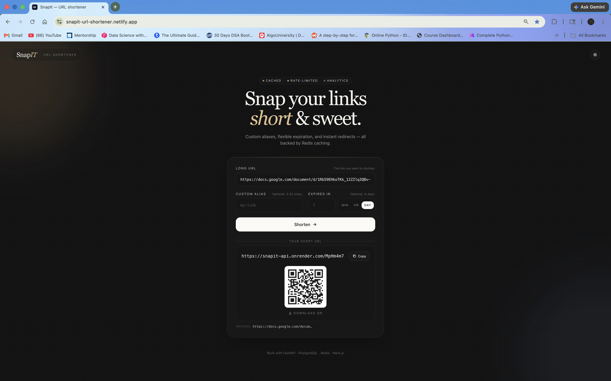
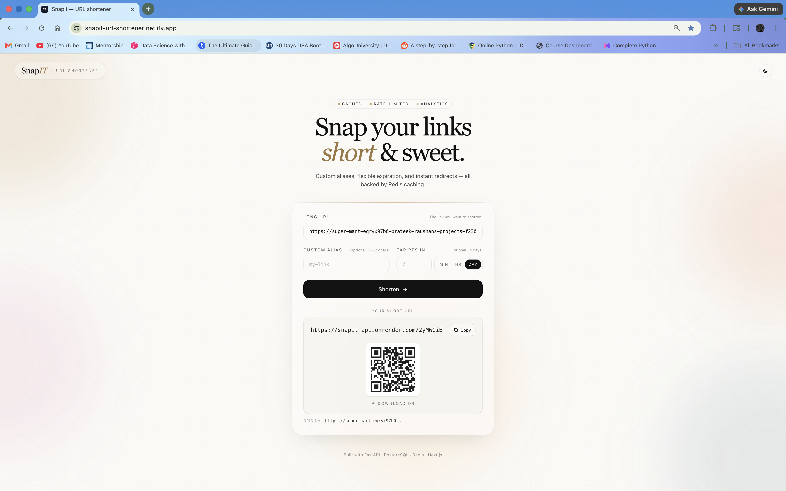
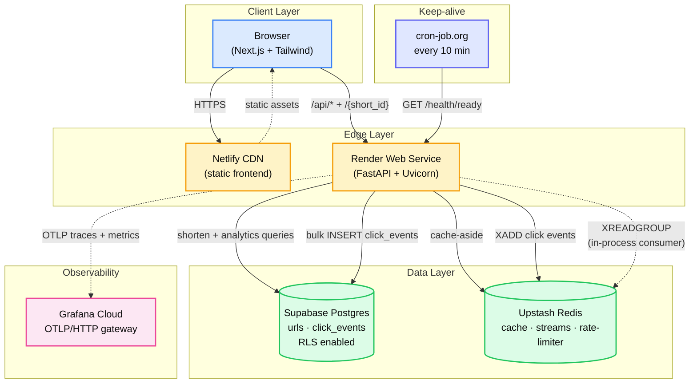
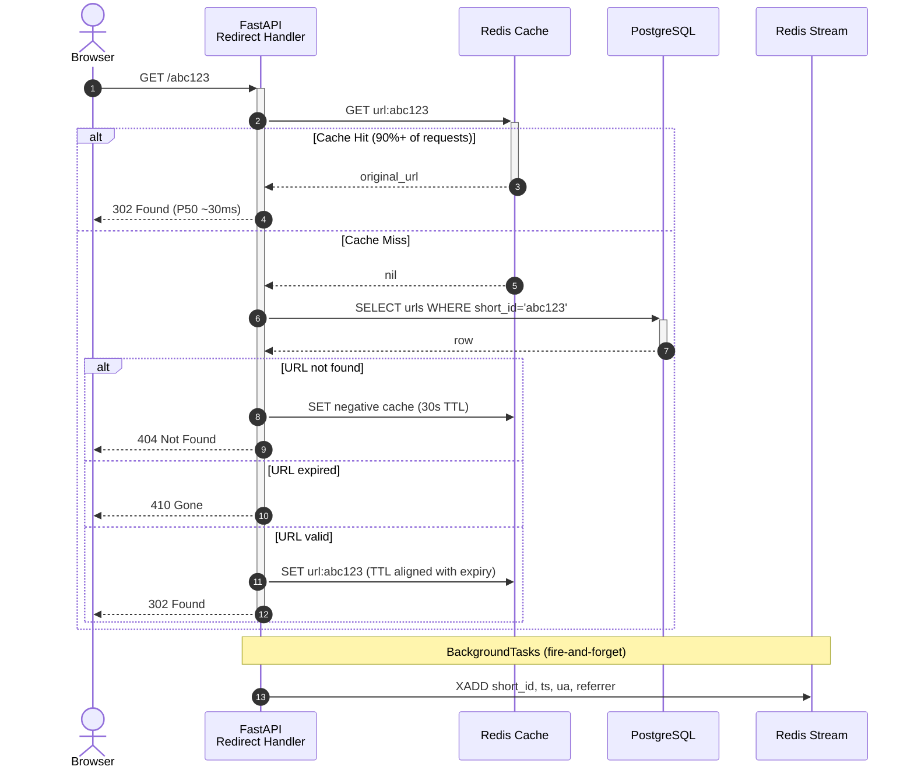
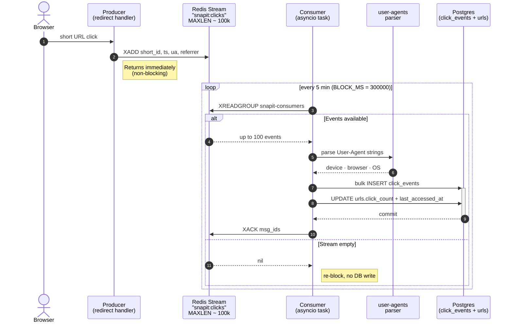
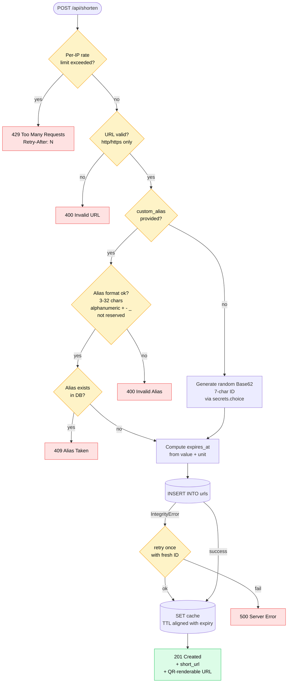

<div align="center">
  <h1> SnapIT — URL Shortener</h1>
  <p>
    <b>A production-grade, event-driven URL shortener with sub-50ms redirects, distributed tracing, and per-link device analytics.</b>
  </p>
  <p>
    <a href="https://snapit-url-shortener.netlify.app">
      
    </a>
    <a href="https://github.com/simply-mihir/SnapIT/releases">
      
    </a>
    <a href="LICENSE">
      
    </a>
  </p>

  <p>
    
    
    
    
    
    
    
    
    
  </p>

  
  
</div>

---

**SnapIT** is a low-latency URL shortener built around three architectural pillars:

1.  **Redis cache-aside** for sub-50ms hot-path redirects
2.  **Redis Streams** for non-blocking, at-least-once click analytics with crash recovery
3.  **OpenTelemetry → Grafana Cloud** for production-grade observability with traces and metrics

The service runs entirely on free-tier infrastructure (Render + Supabase + Upstash + Netlify + Grafana Cloud + cron-job.org), serves ~20 DAU, and surfaces a live Grafana dashboard with latency percentiles, error rate, cache hit ratio, CPU, memory, and Python GC activity.

---

## Table of Contents

1. [Key Features](#1-key-features)
2. [System Architecture](#2-system-architecture)
3. [Flow Diagrams](#3-flow-diagrams)
   - 3.1 [Redirect Hot Path](#31-redirect-hot-path)
   - 3.2 [Event-Driven Analytics Pipeline](#32-event-driven-analytics-pipeline)
   - 3.3 [Shorten Logic Flowchart](#33-shorten-logic-flowchart)
4. [API Reference](#4-api-reference)
5. [Database Schema](#5-database-schema)
6. [Quick Start — Local Development](#6-quick-start--local-development)
7. [Running Tests](#7-running-tests)
8. [Project Structure](#8-project-structure)
9. [Environment Configuration](#9-environment-configuration)
10. [Free-Tier Deployment Guide](#10-free-tier-deployment-guide)
11. [Observability](#11-observability)
12. [Analytics Pipeline](#12-analytics-pipeline)
13. [Production Notes](#13-production-notes)
14. [Design Documents](#14-design-documents)
15. [License](#15-license)

---

## 1. Key Features

### Core capabilities
-  **Sub-50ms redirects** — Redis cache-aside with negative caching for unknown short IDs
-  **Custom aliases** — race-safe uniqueness enforced by Postgres unique index, with reserved-keyword filtering
-  **Flexible expiration** — TTL specified in minutes, hours, or days; expired links return `410 Gone`
-  **Per-IP rate limiting** — Redis fixed-window counters with `Retry-After` headers
-  **URL validation** — `http`/`https` only, malformed URLs rejected at the schema layer
-  **QR code generation** — every short URL renders an inline QR, downloadable as PNG
-  **Light & dark theme** — custom Tailwind palette with serif headings and glassmorphic UI

### Engineering depth
-  **Event-driven analytics** — Redis Streams + background consumer with at-least-once delivery
-  **Distributed tracing** — OpenTelemetry instrumentation across FastAPI → SQLAlchemy → asyncpg → Redis
-  **Production metrics** — Grafana Cloud dashboard with P50/P95/P99 latency, error rate, CPU, memory, GC activity
-  **Dashboard-as-code** — Grafana JSON committed to repo at [`docs/grafana/service-health.json`](docs/grafana/service-health.json)
-  **Postgres Row-Level Security** — locks down Supabase's auto-generated public REST API
-  **Stateless backend** — horizontally scalable, all state in Postgres + Redis
-  **Containerized** — `docker compose up` for zero-friction local development
-  **Offline test suite** — pytest-asyncio with SQLite + fakeredis, no external services needed

---

## 2. System Architecture



Each layer has a single, well-defined responsibility. The backend is stateless — all session and analytics state lives in Postgres + Redis — so it scales horizontally without code changes.

---

## 3. Flow Diagrams

### 3.1 Redirect Hot Path

The latency-critical path. Optimized for cache hits — DB is touched only on miss.



**Why this is fast:**
- Cache hit path is one Redis `GET` plus a 302 response — no DB roundtrip, no JSON serialization.
- Cache write happens before the response is sent on miss, so the second request is always a hit.
- Negative caching (`__NOT_FOUND__` sentinel with 30s TTL) prevents repeated DB hits for bogus IDs.
- Analytics writes are deferred to a background task — they never block the response.

### 3.2 Event-Driven Analytics Pipeline

Click events are recorded asynchronously with at-least-once delivery semantics via Redis consumer groups.



**Guarantees:**
- **At-least-once delivery** — events stay in the Pending Entries List until XACK'd; consumer crashes redeliver, not lose.
- **Idempotent processing** — duplicate events would create duplicate `click_events` rows, but `click_count` aggregates remain correct because they're computed by the consumer as deltas, not absolute values.
- **Crash recovery** — if the consumer dies mid-batch, the next consumer (or restarted same one) picks up the unacknowledged batch via `XREADGROUP`.
- **Horizontal scaling** — adding a second consumer to the same group automatically load-balances new messages between consumers, no code changes.

### 3.3 Shorten Logic Flowchart

Decision tree for `POST /api/shorten`.



---

## 4. API Reference

| Method | Path | Description |
| :--- | :--- | :--- |
| `POST` | `/api/shorten` | Create a short URL (optionally with custom alias + expiration) |
| `GET`  | `/api/analytics/{short_id}` | Retrieve enriched analytics — clicks, device/browser/OS breakdown, recent events |
| `GET`  | `/{short_id}` | 302 Redirect to original (404 if missing, 410 if expired) |
| `GET`  | `/health/live` | Liveness probe — process is alive |
| `GET`  | `/health/ready` | Readiness probe — verifies Postgres + Redis reachable |
| `GET`  | `/docs` | OpenAPI Swagger UI (auto-generated) |

<details>
<summary><b> POST <code>/api/shorten</code> — request & response</b></summary>

**Request:**
```json
{
  "original_url": "https://example.com/very/long/path",
  "custom_alias": "my-link",
  "expires_in_value": 7,
  "expires_in_unit": "days"
}
```

`expires_in_unit` accepts `"minutes"`, `"hours"`, or `"days"`. Legacy `expires_in_days` is still accepted for backwards compatibility.

**Response (201 Created):**
```json
{
  "short_id": "my-link",
  "short_url": "https://snapit-api.onrender.com/my-link",
  "original_url": "https://example.com/very/long/path",
  "custom_alias": "my-link",
  "created_at": "2026-05-20T10:15:00Z",
  "expires_at": "2026-05-27T10:15:00Z"
}
```

**Error codes:** `400` invalid URL or alias · `409` alias already taken · `429` rate limited

</details>

<details>
<summary><b> GET <code>/api/analytics/{short_id}</code> — enriched response</b></summary>

```json
{
  "short_id": "my-link",
  "original_url": "https://example.com/...",
  "click_count": 142,
  "created_at": "2026-05-20T10:15:00Z",
  "last_accessed_at": "2026-05-22T14:38:21Z",
  "expires_at": "2026-05-27T10:15:00Z",
  "is_expired": false,
  "by_device": [
    { "label": "desktop", "count": 89 },
    { "label": "mobile", "count": 51 },
    { "label": "tablet", "count": 2 }
  ],
  "by_browser": [
    { "label": "Chrome 124.0.0", "count": 76 },
    { "label": "Safari 17.4", "count": 33 },
    { "label": "Mobile Safari 17.4", "count": 28 }
  ],
  "by_os": [
    { "label": "Mac OS X 10.15.7", "count": 64 },
    { "label": "iOS 17.4.1", "count": 28 },
    { "label": "Windows 10", "count": 25 }
  ],
  "by_referrer": [
    { "label": "https://twitter.com/", "count": 18 },
    { "label": "https://news.ycombinator.com/", "count": 12 }
  ],
  "recent_clicks": [
    {
      "occurred_at": "2026-05-22T14:38:21Z",
      "device": "mobile",
      "browser": "Mobile Safari 17.4",
      "os": "iOS 17.4.1",
      "referrer": "https://twitter.com/"
    }
  ]
}
```

</details>

---

## 5. Database Schema

### Table: `urls` (dimension)

| Column | Type | Notes |
| :--- | :--- | :--- |
| `id` | `bigint` | PK, autoincrement |
| `original_url` | `varchar(2048)` | Not null |
| `short_id` | `varchar(64)` | **Unique, indexed** (hot-path lookup) |
| `custom_alias` | `varchar(64)` | Unique, indexed, nullable |
| `created_at` | `timestamptz` | Default `now()` |
| `expires_at` | `timestamptz` | Indexed (for cleanup jobs), nullable |
| `click_count` | `integer` | Default 0, bumped by consumer in batches |
| `last_accessed_at` | `timestamptz` | Nullable, updated by consumer |

### Table: `click_events` (fact)

One row per redirect. Materialized asynchronously by the stream consumer.

| Column | Type | Notes |
| :--- | :--- | :--- |
| `id` | `bigint` | PK, autoincrement |
| `short_id` | `varchar(64)` | FK → `urls.short_id` `ON DELETE CASCADE`, indexed |
| `occurred_at` | `timestamptz` | When the click happened (parsed from event timestamp) |
| `device` | `varchar(32)` | desktop · mobile · tablet · bot |
| `browser` | `varchar(64)` | e.g. `"Chrome 124.0.0"` |
| `os` | `varchar(64)` | e.g. `"iOS 17.4.1"` |
| `user_agent` | `varchar(512)` | Raw UA string (truncated) |
| `referrer` | `varchar(512)` | Document referrer (truncated) |

**Indexes:** composite `(short_id, occurred_at)` for fast per-link time-series queries.

---

## 6. Quick Start — Local Development

The entire stack is containerized for zero-friction setup.

```bash
# Clone
git clone https://github.com/simply-mihir/SnapIT.git
cd SnapIT

# Boot the stack (Postgres + Redis + Backend + Frontend)
docker compose up --build
```

**Access points:**
-  Frontend → [http://localhost:3000](http://localhost:3000)
-  Backend API → [http://localhost:8000](http://localhost:8000)
-  Swagger UI → [http://localhost:8000/docs](http://localhost:8000/docs)
-  Postgres → `localhost:5432` *(user: `postgres` / pass: `postgres`)*
-  Redis → `localhost:6379`

The backend auto-creates DB tables on first boot via `init_db()` for local-dev convenience.

---

## 7. Running Tests

The test suite transparently swaps Postgres for SQLite (`aiosqlite`) and Redis for `fakeredis`, so tests run entirely offline — no Docker needed.

```bash
cd backend

# Create + activate a virtualenv
python -m venv .venv
source .venv/bin/activate   # Windows: .venv\Scripts\activate

# Install dependencies
pip install -r requirements.txt
pip install fakeredis pytest

# Run
pytest -q
```

Covers shorten/redirect, custom alias collisions, invalid URLs, reserved aliases, expiration handling, and click-count analytics.

---

## 8. Project Structure

```text
SnapIT/
├── backend/
│   ├── app/
│   │   ├── main.py                       # FastAPI app + lifespan (DB, cache, consumer)
│   │   ├── observability.py              # OpenTelemetry setup
│   │   ├── core/                         # config, utils, exceptions
│   │   ├── db/database.py                # async SQLAlchemy engine + session
│   │   ├── models/
│   │   │   ├── url.py                    # URL ORM model
│   │   │   └── click_event.py            # ClickEvent fact table model
│   │   ├── schemas/url.py                # Pydantic request/response models
│   │   ├── services/
│   │   │   ├── cache.py                  # Redis cache-aside helpers
│   │   │   ├── rate_limiter.py           # Per-IP fixed-window limiter
│   │   │   ├── url_service.py            # Core business logic
│   │   │   ├── event_producer.py         # Redis Streams producer (XADD)
│   │   │   └── event_consumer.py         # Background consumer (XREADGROUP)
│   │   └── routes/
│   │       ├── shorten.py                # /api/shorten + /api/analytics
│   │       ├── redirect.py               # / hot path
│   │       ├── health.py                 # /health/live + /health/ready
│   │       └── deps.py                   # FastAPI deps
│   ├── tests/                            # pytest suite (SQLite + fakeredis)
│   └── Dockerfile
├── frontend/
│   ├── pages/                            # _app.js, index.js
│   ├── components/                       # ShortenerForm (with QR), ThemeToggle
│   ├── styles/globals.css                # Tailwind + custom palette
│   └── Dockerfile
├── docs/
│   ├── grafana/service-health.json       # Dashboard-as-code
│   ├── grafana-dashboard.png             # Dashboard screenshot
│   ├── screenshot.png                    # UI screenshot
│   └── design/
│       └── id-generation.md              # Base62 vs Snowflake design note
├── netlify.toml                          # Frontend build config
└── docker-compose.yml
```

---

## 9. Environment Configuration

Backend (`backend/.env.example`):

| Variable | Purpose |
| :--- | :--- |
| `DATABASE_URL` | Async SQLAlchemy URL — `postgresql+asyncpg://...` |
| `REDIS_URL` | Redis connection (use `rediss://` for TLS) |
| `BASE_URL` | Public origin used to build returned short URLs |
| `CORS_ORIGINS` | Comma-separated allowed frontend origins |
| `RATE_LIMIT_MAX_REQUESTS` / `RATE_LIMIT_WINDOW_SECONDS` | Per-IP throttle |
| `CACHE_DEFAULT_TTL` | Default Redis TTL for cached URLs (seconds) |
| `SHORT_ID_LENGTH` | Base62 length (default 7 → 62⁷ ≈ 3.5T keyspace) |
| `OTEL_EXPORTER_OTLP_ENDPOINT` | Grafana Cloud OTLP gateway URL |
| `OTEL_EXPORTER_OTLP_HEADERS` | `Authorization=Basic <base64>` for OTLP auth |
| `OTEL_EXPORTER_OTLP_PROTOCOL` | `http/protobuf` |
| `OTEL_SERVICE_NAME` | e.g. `snapit-backend` |
| `OTEL_RESOURCE_ATTRIBUTES` | `service.namespace=snapit,deployment.environment=production` |

Frontend (`frontend/.env.example`):

| Variable | Purpose |
| :--- | :--- |
| `NEXT_PUBLIC_API_URL` | Backend origin (used by the browser) |

---

## 10. Free-Tier Deployment Guide

Deploying SnapIT for **$0/month**:

| Component | Provider | Free Tier Limit |
| :--- | :--- | :--- |
| Backend (FastAPI) | Render Web Service | 750h/month, 0.5 vCPU, 512 MB |
| Database (Postgres) | Supabase | 500 MB storage, 2 GB egress |
| Cache + Streams (Redis) | Upstash | 500k commands/month, 256 MB |
| Frontend (Next.js) | Netlify | 100 GB bandwidth/month |
| Observability | Grafana Cloud | 10k metrics, 50 GB traces, 14d retention |
| Keep-alive | cron-job.org | 14,400 executions/day |

### Setup steps

1. **Postgres (Supabase):** Create a project → Connect → use the **Transaction Pooler** URL (port 6543). Change prefix to `postgresql+asyncpg://`. Enable RLS via `ALTER TABLE urls ENABLE ROW LEVEL SECURITY;` in SQL Editor.

2. **Redis (Upstash):** Create a free Redis DB → enable eviction → copy the `rediss://` URL.

3. **Backend (Render):** New Web Service → Root directory `backend/` → Health check path `/health/ready`. Set env vars (see § 9).

4. **Frontend (Netlify):** Import repo → Base directory `frontend/` → Build cmd `npm run build` → Publish `.next`. Add `NEXT_PUBLIC_API_URL`. The repo includes a [`netlify.toml`](netlify.toml) with this config baked in.

5. **Observability (Grafana Cloud):** Sign up → create OTLP token with `metrics:write`, `traces:write` scopes → set the five `OTEL_*` env vars on Render → import `docs/grafana/service-health.json` as a dashboard.

6. **Keep-alive (cron-job.org):** Create a job hitting `https://<your-backend>.onrender.com/health/ready` every 10 minutes. This prevents Render's 15-minute cold-start sleep AND keeps Supabase from auto-pausing after 7 days of idle.

---

## 11. Observability

Production traffic is fully instrumented via OpenTelemetry, with traces and metrics exported to Grafana Cloud over OTLP.


**What's emitted:**
-  **Distributed traces** — per-request flame graphs spanning FastAPI → SQLAlchemy → asyncpg → Redis
-  **Histogram metrics** — request duration P50/P95/P99 by method and status code
-  **Counter metrics** — request volume, error rate, status code distribution
-  **System metrics** — CPU utilization, memory (RSS), Python GC activity by generation

**Dashboard layout** (11 panels):

| Row | Panels |
| :--- | :--- |
| KPIs | Active Requests · Request Rate · Error Rate · P95 Latency |
| Application | Request Rate by Method · Latency Percentiles (P50/P95/P99) |
| Infrastructure | CPU Utilization · Memory (RSS %) |
| Diagnostics | Status Code Distribution · Python GC Collections |
| Drill-in | Active Requests by Method |

The dashboard config is committed at [`docs/grafana/service-health.json`](docs/grafana/service-health.json) and can be re-imported into any Grafana instance.

---

## 12. Analytics Pipeline

Click analytics are decoupled from the redirect hot path via Redis Streams. Each redirect publishes a click event; a background consumer drains the stream, parses User-Agent strings, and materializes events into the `click_events` fact table.

**Key components:**

| File | Role |
| :--- | :--- |
| [`event_producer.py`](backend/app/services/event_producer.py) | Non-blocking `XADD` from redirect handler |
| [`event_consumer.py`](backend/app/services/event_consumer.py) | Batched `XREADGROUP` + bulk-insert + `XACK` |
| [`click_event.py`](backend/app/models/click_event.py) | ORM model — composite index `(short_id, occurred_at)` |

**Delivery semantics:** at-least-once, via Redis consumer groups. `XACK` fires only after successful DB commit — crashes redeliver, never lose.

**Exposed via API:** `GET /api/analytics/{short_id}` returns aggregated breakdowns (device, browser, OS, top referrers) plus the 10 most recent click events with full dimensions.

For an architectural deep-dive, see [Release v1.3.0](https://github.com/simply-mihir/SnapIT/releases/tag/v1.3.0).

---

## 13. Production Notes

The service is production-deployed, but a few items would tighten it further before scaling beyond current traffic:

- **Migrations:** `init_db()` runs on startup for zero-friction dev and current production needs. Swap for explicit Alembic migrations once schema changes become frequent.
- **High Availability:** the backend is stateless (state lives in Postgres + Redis), so it scales horizontally without code changes. To go from single-instance to multi-instance, run Uvicorn with multiple workers behind a reverse proxy. Redis consumer groups automatically load-balance the click-event stream across all consumers.
- **Consumer isolation:** the Redis Streams consumer currently runs in-process with FastAPI. Splitting it into a dedicated worker service would let the redirect dyno and analytics worker scale independently — same `XREADGROUP` flow, just a separate process.
- **Data retention:** add a nightly cleanup job to delete expired URL rows (`expires_at < now() - interval '7 days'`) and aged click events (e.g. `occurred_at < now() - interval '90 days'`) to keep Postgres lean.
- **Consumer block tuning:** `BLOCK_MS` is set to 5 minutes — sized to keep Redis command count well within Upstash's free tier while preserving at-least-once semantics. Tune lower for higher analytics freshness if traffic warrants.

---

## 14. Design Documents

In-depth rationale for non-obvious architectural choices lives in [`docs/design/`](docs/design/):

- [**Short ID generation**: Base62 vs Snowflake vs UUID](docs/design/id-generation.md) — why we picked 7-character random Base62 with collision retry, and when we'd revisit.

---

## 15. License

MIT — see [LICENSE](LICENSE).

---

<div align="center">
  <sub>Built by <a href="https://github.com/simply-mihir">@simply-mihir</a> · Live at <a href="https://snapit-url-shortener.netlify.app">snapit-url-shortener.netlify.app</a></sub>
</div>
